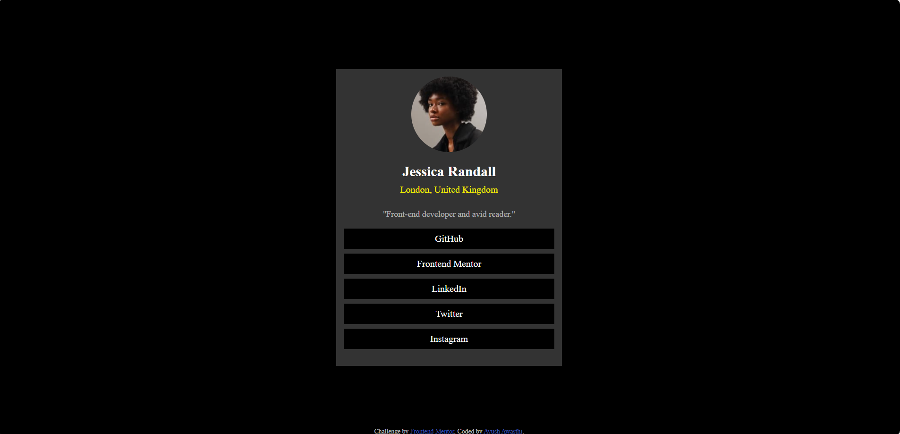

# Frontend Mentor - Social links profile solution

This is a solution to the [Social links profile challenge on Frontend Mentor](https://www.frontendmentor.io/challenges/social-links-profile-UG32l9m6dQ).

## Table of contents

- [Overview](#overview)
  - [Screenshot](#screenshot)
  - [Links](#links)
- [My process](#my-process)
  - [Built with](#built-with)

## Overview

The goal is to build a social profile card.

### Screenshot

### Links

- Live Site URL: [https://ayush-awasthi431.github.io/social-links-profile-main/]

## My process

### Built with

- Semantic HTML5 markup
- CSS custom properties
- Flexbox

